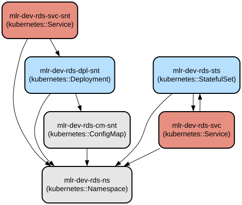

# Kubernetes Redis High Availability Cluster with Sentinel

This project provides a production-ready Redis high availability setup in Kubernetes using Redis Sentinel for automatic failover. It deploys a 3-node Redis cluster with one primary and two replicas, managed by three Redis Sentinel instances for high availability and automatic failover capabilities.

The setup implements Redis clustering best practices with automatic primary-replica configuration and failover management. It uses StatefulSets for maintaining stable network identities of Redis nodes and Deployments for Sentinel instances. The configuration includes automatic primary detection, replica synchronization, and sentinel monitoring, making it suitable for production environments requiring high availability and data persistence.

## Repository Structure
```
.
├── 01-redis-ns.yaml              # Defines dedicated namespace for Redis resources
├── 02-cm-rds-snt.yaml           # ConfigMap for Redis Sentinel configuration
├── 02-cm-rds.yaml               # ConfigMap for Redis primary and replica configuration
├── 03-svc-rds.yaml              # Services for Redis and Sentinel network access
├── 04-sts-rds.yaml              # StatefulSet for Redis primary-replica deployment
└── 05-dpl-rds-snt.yaml          # Deployment for Redis Sentinel instances
```

## Usage Instructions
### Prerequisites
- Kubernetes cluster (version 1.19+)
- kubectl CLI tool installed and configured
- Access to a container registry (default configuration uses 192.168.56.200)
- Redis 7.0 container images available in your registry

### Installation

1. Create the Redis namespace:
```bash
kubectl apply -f 01-redis-ns.yaml
```

2. Apply the ConfigMaps:
```bash
kubectl apply -f 02-cm-rds.yaml
kubectl apply -f 02-cm-rds-snt.yaml
```

3. Create the Services:
```bash
kubectl apply -f 03-svc-rds.yaml
```

4. Deploy Redis nodes:
```bash
kubectl apply -f 04-sts-rds.yaml
```

5. Deploy Sentinel instances:
```bash
kubectl apply -f 05-dpl-rds-snt.yaml
```

### Quick Start

1. Verify the deployment:
```bash
kubectl get pods -n mlr-dev-rds-ns
```

2. Check Redis cluster status:
```bash
kubectl exec -it -n mlr-dev-rds-ns mlr-dev-rds-sts-0 -- redis-cli info replication
```

3. Verify Sentinel status:
```bash
kubectl exec -it -n mlr-dev-rds-ns deployment/mlr-dev-rds-dpl-snt -- redis-cli -p 26379 sentinel master mymaster
```

### More Detailed Examples

1. Connect to Redis primary:
```bash
kubectl exec -it -n mlr-dev-rds-ns mlr-dev-rds-sts-0 -- redis-cli
```

2. Test replication status:
```bash
kubectl exec -it -n mlr-dev-rds-ns mlr-dev-rds-sts-1 -- redis-cli info replication
```

### Troubleshooting

Common Issues:

1. Pods stuck in pending state
- Check node resources:
```bash
kubectl describe nodes
```
- Verify PVC status if using persistent storage

2. Sentinel not detecting primary
- Check Sentinel logs:
```bash
kubectl logs -n mlr-dev-rds-ns -l app=mlr-dev-rds-dpl-snt
```
- Verify DNS resolution:
```bash
kubectl exec -it -n mlr-dev-rds-ns mlr-dev-rds-dpl-snt -- nslookup mlr-dev-rds-sts-0.mlr-dev-rds-svc
```

3. Replication issues
- Check replica logs:
```bash
kubectl logs -n mlr-dev-rds-ns mlr-dev-rds-sts-1
```
- Verify network connectivity between pods

## Data Flow
The Redis cluster operates with one primary node handling writes and two replica nodes maintaining synchronized copies of data. Sentinel monitors the cluster health and manages failover operations.

```ascii
                    ┌─────────────┐
                    │  Sentinel   │
                    │   Cluster   │
                    └──────┬──────┘
                           │
                           ▼
┌─────────────┐    ┌─────────────┐    ┌─────────────┐
│   Redis     │◄───│    Redis    │───►│   Redis     │
│  Replica 1  │    │   Primary   │    │  Replica 2  │
└─────────────┘    └─────────────┘    └─────────────┘
```

Component Interactions:
- Redis primary accepts write operations and replicates to replicas
- Replicas maintain synchronization with primary
- Sentinel monitors primary availability (every 5000ms)
- Sentinel initiates failover if primary becomes unavailable
- Services provide stable networking endpoints
- ConfigMaps supply dynamic configuration
- StatefulSet maintains stable network identities
- Deployment manages Sentinel replica scaling

## Infrastructure



### Kubernetes Resources
- Namespace: `mlr-dev-rds-ns`
- ConfigMaps:
  - `mlr-dev-rds-cm-snt`: Sentinel configuration
  - Redis configuration for primary/replica nodes
- Services:
  - Headless service for Redis StatefulSet
  - ClusterIP service for Sentinel access
- StatefulSet:
  - 3 Redis nodes (1 primary, 2 replicas)
- Deployment:
  - 3 Sentinel instances for HA monitoring